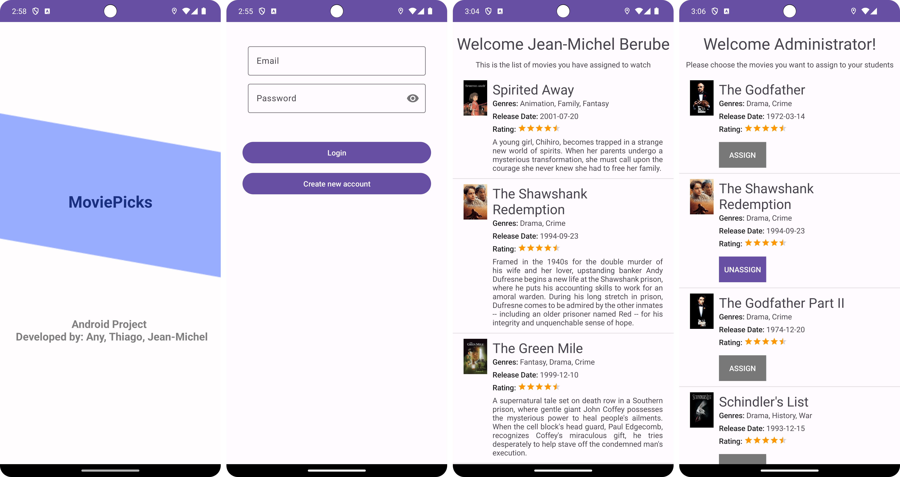

# Movies Assignment App
This application allows a teacher to select and assign movies from a list for their students to watch as assignment.

## Developers: 
- 🐣 [@JeanMichelBB](https://github.com/JeanMichelBB)
- 🤙 [@tksakamoto](https://github.com/tksakamoto)
- 🐈 [@anyruizd](https://github.com/anyruizd)

## APIs:
Custom API created to retrieve the list of movies as we need. 
https://my-json-server.typicode.com/JeanMichelBB/Android-Project/db

## Database:

Firebase Real Time Database

## Views:

### View 1: Splash Screen

- App title
- Developers names

### View 2: Login page

- Button log in
- Button create new account
- Input fields + labels: 
    - Email 
    - Password

### View 2: Registration page

- Input fields + labels: 
    - Username 
    - Password
    - Full name
- Button: create account
- Button: go back to log in

### View 3: List of movies to assign (For the Admin) 
- ListView with the list of movies retrieved from the API
- ListView Item containing:
  - ImageView with the movie cover
  - Movie Title
  - List of Genres
  - Release Date
  - Rating bar
  - Switch to assign/ unassign the movie

### View 4: List of assigned movies (For the Students)
- ListView with the list of assigned movies retrieved from the DataBase
- ListView Item containing:
  - ImageView with the movie cover
  - Movie Title
  - List of Genres
  - Release Date
  - Rating bar
  - Description of the movie
